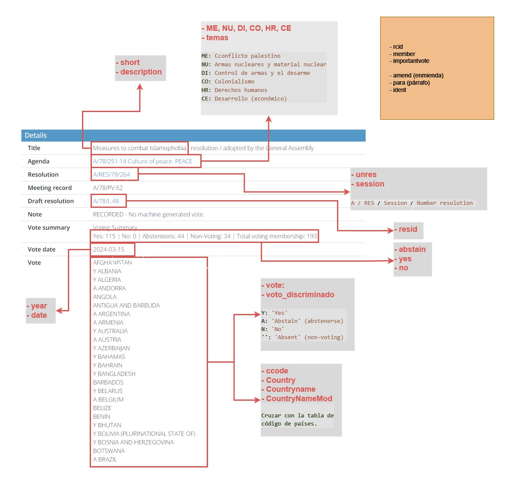

# Documentación de Archivos del Proyecto

Los datos y ficheros utilizados los podemos dividir en dos partes bien diferenciadas. Por un lado están los relacionados con el análisis de las **votaciones** de los países en la **Asamblea General** de las **Naciones Unidas** y por otro los relacionados con la parte del modelo de **NLP** de la **opinión consultiva** a la **Corte Internacional de Justicia**.

## Votaciones de Naciones Unidas

En el caso de las votaciones, partimos del dataset en formato CSV creado por la **Harvard University DataVerse** y el repositorio denominado [United Nations General Assembly Voting Data](https://dataverse.harvard.edu/dataset.xhtml?persistentId=hdl%3A1902.1%2F12379). El Harvard University DataVerse es una plataforma de almacenamiento y gestión de datos de investigación que permite a los investigadores almacenar, compartir y acceder a datos de manera segura y organizada. DataVerse es una de las iniciativas de la Universidad de Harvard para promover la transparencia y la reproducibilidad en la investigación científica. Los ficheros se pueden encontrar en la carpeta *Dataverse Files*, que contiene:

- Dataset de Harvard sobre las votaciones ordinarias de la Asamblea General.

- Archivos de soporte y el Codebook que explica detalladamente cada una de las variables.

- Base de datos modificada que contiene información asociada a las opiniones consultivas utilizadas como casos de estudio.

El **United Nations General Assembly Voting Data** contiene los registros y datos de las votaciones que se realizan en la Asamblea General de las Naciones Unidas, pero sólo desde la primera votación en 1946 hasta 2014. El resto de datos hasta el día actual fueron obtenidos de la biblioteca digital de la [Biblioteca Digital de la ONU](https://digitallibrary.un.org/search?ln=en&cc=Voting+Data&p=&f=&action_search=Search&rm=&sf=&so=d&rg=50&c=Voting+Data&c=&of=hb&fti=0&fti=0).

La Biblioteca Digital de la ONU, conocida como **United Nations Digital Library** (UNDL), es un recurso en línea que proporciona **acceso** a una amplia gama de **documentos, publicaciones y materiales** relacionados con las actividades y el trabajo de las **Naciones Unidas**. Es una iniciativa para facilitar el acceso a la información de la ONU de manera gratuita y abierta a todos los usuarios.

Por tanto, desde este recurso pudimos consultar los **detalles** de las **votaciones** sobre las **resoluciones y decisiones** tomadas por la ONU **a partir de 2014**. En este caso, tuvimos que utilizar técnicas de Scrapping para obtener los datos necesarios.

### Crawling

Montamos un sistema de Crawling para **extraer** todas las **URLs** de las resoluciones de votación desde las páginas de resultados. Implementamos una lógica de paginación para navegar a través de las páginas sucesivas hasta que no hubiera más páginas de resultados.

Para ello, configuramos un sistema utilizando **Selenium** y un **WebDriver** de Firefox, con el objetivo de abrir cada URL y comenzar la extracción de los datos relevantes de cada resolución.

### Scrapping

Para la extracción de los datos, procesamos cada URL usando la bibioteca **lxml**. Lxml nos permite manipular y analizar documentos **HTML** y XML de manera eficiente y rápida. Con ella, abrimos y leemos los archivos de las resoluciones almacenados localmente. En el siguiente esquema, mostramos la ubicación visual de cada dato relevante:

 

Posteriormente, almacenamos los datos procesados en un formato adecuado para luego tratar el archivo y **formatearlo** en JSON, CSV o el que se necesitara para el análisis posterior del dataset.

No se concretó el formato de los datos inmediatamente para facilitar la toma de decisiones en pro del análisis y la visualización futura.

Todos los ficheros relacionados con esta parte se encuentran en la carpeta **"UN Votes Crawler"**.

Finalmente, mergeamos los datos de ambas fuentes en un sólo dataset.

## Opinión consultiva a la ICJ

Para el caso de la opinión consultiva a la **Corte Internacional de Justicia**, los datos los obtuvimos del sitio oficial de la misma ICJ. En este caso, la información relevante viene dada en documentos **PDF** y nuestra idea principal era obtenerlos utilizando técnicas de **Scrapping** y **Crawling**, pero debido a la arquitectura y estructura de la web no fuimos capaces. Por lo que decidimos descargar manualmente los ficheros relacionados con el caso concreto que ibamos a estudiar y como tarea futura idear la forma de automatizar la obtención de estos documentos.

Los documentos en brutos se alojan en la carpeta ICJ Inventario OC y se clasifican de la siguiente manera:

- Archivos asociados a las opiniones consultivas de 2004 y 2023.

- Dentro de estas carpetas, se encuentran:
    - Opiniones consultivas (Advisory Opinions)

    - Procedimientos orales (Oral Proceedings)

    - Procedimientos escritos (Written Proceedings)

    #### **Documentos Soporte Advisor Opinion ES**:
    - Contiene el resumen de las opiniones consultivas en español.

    - Incluye la opinión consultiva completa en español.

## Segmentación:

Las carpetas cuentan con la siguiente clasificación de los documentos:

- **Advisory Opinion**: Opinión consultiva separada por:
    
    - Preguntas Individuales
    
    - Argumentos específicos a cada pregunta
    
    - Opinión individual de los Jueces

  Estos archivos se encuentran en formato de texto plano y JSON

- **Oral Proceedings 2004/2023**: Opiniones orales individuales de los países, separados por año.

  Estos archivos se encuentran en formato JSON

#### **¿Por qué?**

Decidimos segmentar los archivos para transformar los documentos originales en formatos que consideramos más manejables y estructurados, específicamente para su uso posterior en nuestro modelo de NLP. 
Este proceso nos permitió separar y organizar las opiniones de los países, las opiniones de los jueces y otros elementos relevantes de manera que se puedan analizar de forma más eficiente y precisa.

#### ***¿Cómo lo hicimos?***

En un principio utilizamos la librería [`PyPDF2`](https://pypdf2.readthedocs.io/en/3.x/), una librería de Python diseñada para extraer y manipular información de archivos PDF, con esta, extrajimos los textos de los documentos en formato PDF y convertirlos en texto plano (.txt). Esto nos permitió estructurar los archivos de la opinión consultiva (Advisory Opinion) dividiéndola en preguntas específicas, argumentos específicos de cada pregunta y opiniones individuales de cada juez.

#### ***Dificultades encontradas***

Principalmente, encontramos dificultades a la hora de tratar los Oral Proceedings. Esto, debido a la calidad de digitalización proporcionada por la ONU, los documentos no se procesaban correctamente con PyPDF2, lo que nos obligó a tener que revisar los archivos. Además, la falta de tiempo impidió que procesáramos las opiniones escritas (Written Proceedings), también por el mismo problema de digitalización, lo que limitó el alcance de nuestro dataset inicial

## Archivos consolidados:

La carpeta 'Consolidated Files' contiene documentos clave utilizados en el maquetado del modelo NLP:

- **A.RES_77.247_301222.txt**: Texto completo de la solicitud de [Opinión Consultiva 2023](https://github.com/pardo2410/ProyectoFinalBootcampBigData/blob/main/01%20-%20Dataset/1.%20ICJ%20Inventario%20OC/2023/Resolution%20UN/A_RES_77_247-ES.pdf) por parte de la asamblea general, abarcando las preguntas individuales y los argumentos específicos para cada una de ellas.
- **DatasetNLP-UN-ICJ-Consolidado.json**: Consolidado de los procedimientos orales de los años 2004 y 2023, incluyendo las opiniones de los jueces y los países, discriminando año.
- **DatasetNLP-UN-ICJ-Q&A.json**: Archivo que contiene clasificada las respuestas de la corte en la [Opinión Consultiva del 2004](https://github.com/pardo2410/ProyectoFinalBootcampBigData/blob/main/01%20-%20Dataset/1.%20ICJ%20Inventario%20OC/2004/Advisory%20Opinions/131-20040709-ADV-01-00-EN.pdf)
- **Oral_Proceeding_2004.json**: Documento que detalla las opiniones orales de los países correspondientes al año 2004.
- **Oral_Proceeding_2023.json**: Similar al anterior pero referente al año 2023, con las opiniones de los países en el tema actual sucediente en Palestina.
- **Question (a).txt y Question (b).txt**: Contienen las preguntas 'a' y 'b', respectivamente, junto con los argumentos que la Corte abordará en 2024.

Decidimos hacer las consolidaciones de los archivos en pro del futuro modelo NLP que montaríamos, esto nos facilitó de sobremanera el manipular de manera ordenada los datos usados.
